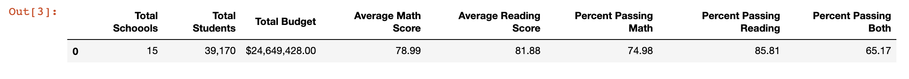
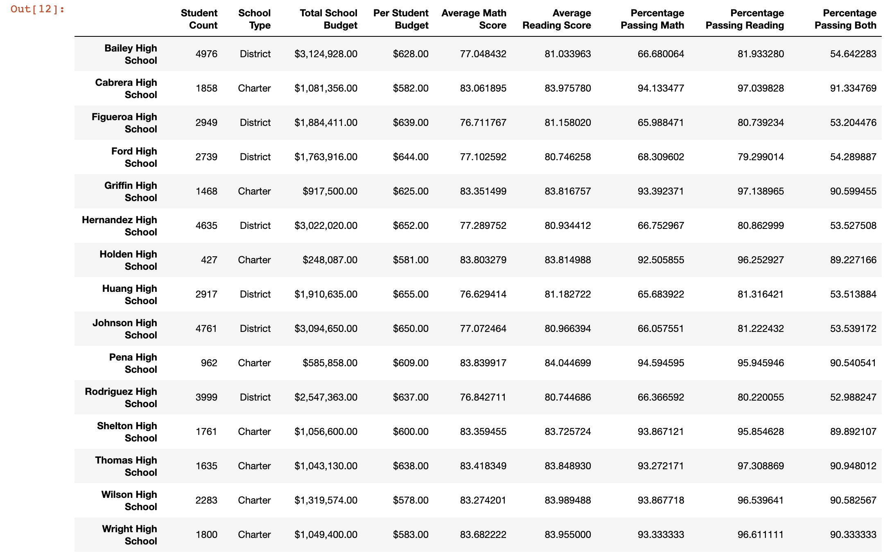
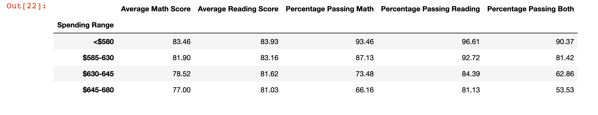
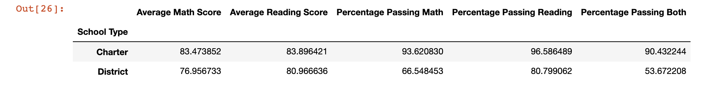
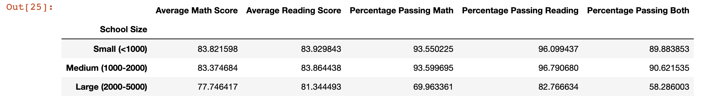

## Summary

With almost 40,000 students within the district, I looked at the district-wide standard test results (found in the [students_complete.csv](data/student_complete.csv)) among  15 schools, with their data found in [schools_complete.csv](data/schools_complete.csv)). My goal is to use Pandas to aggregate the data in order to showcase trends in school performance. 

## Scope

Before performing any aggregations for analysis, both datasets had to be loaded in using Pandas, and stored as Pandas Dataframes. Then the next step was to combine both dataframes into one dataframe to be able to include school information with the student information.

I created Python scripts in order to manipulate the original dataframe to create new dataframes that show us:
 - District Summary

 

 - School Summary

 

 - Scores by School Spending

 

 - Scores by School Type
 
 

 - Scores by School Size
 

 - Top and Bottom Performing Schools
 - Math and Reading Scores by Grade
